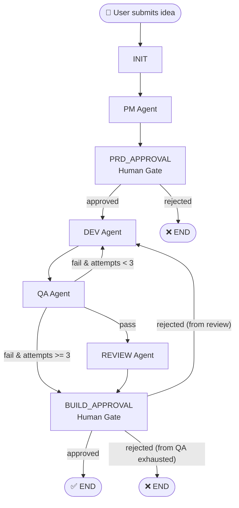

# AI Software Factory — System Requirements Document

> **Version:** 1.0.0  
> **Author:** Rahul Jidge  
> **Last Updated:** 2026-04-29  
> **Status:** Active Development

---

## 1. System Overview

The **AI Software Factory** is an autonomous software development pipeline that takes a user's app idea and produces a fully functional **Web Application** — with minimal human intervention. It orchestrates multiple AI agents through a state-machine graph (powered by LangGraph) with human approval gates at critical decision points.

### 1.1 High-Level Flow

```
User Idea → PRD Generation → PRD Approval → Code Generation → QA Validation → Code Review → Build Approval → Web App Output
```

### 1.2 Architecture Diagram



---

## 2. Technology Stack

| Component | Technology | Version |
|-----------|-----------|---------|
| Language | Python | ^3.11 |
| Orchestration | LangGraph | ^1.1.3 |
| API Framework | FastAPI | ^0.110.0 |
| LLM Provider | OpenAI (GPT-4o-mini) | ^1.0.0 |
| Target Tech | HTML5, CSS3, JavaScript | Modern ES6+ |
| Build/QA | Local validation | — |

---

## 3. Project Structure

```
ai-software-factory/
├── app/
│   ├── api.py                          # FastAPI endpoints (entry point)
│   ├── agents/                         # AI agent nodes
│   │   ├── pm_agent.py                 # Product Manager — generates PRD
│   │   ├── dev_agent.py                # Developer — generates/fixes code
│   │   ├── qa_agent.py                 # QA — builds & tests code
│   │   ├── reviewer_agent.py           # Reviewer — reviews code quality
│   │   └── human_node.py              # Human approval gate (interrupt)
│   ├── graph/
│   │   └── main_graph.py              # LangGraph state machine definition
│   ├── core/
│   │   ├── config.py                   # Environment config (dotenv)
│   │   └── llm.py                      # OpenAI client wrapper
│   ├── tools/
│   │   ├── file_saver.py              # Parses LLM FILE: output → disk
│   │   ├── file_manager.py            # Alternative file writer (unused)
│   │   ├── docker_runner.py           # Docker-based Android build
│   │   ├── android_builder.py         # Local Gradle build (unused)
│   │   ├── code_executor.py           # (placeholder — not implemented)
│   │   └── git_tool.py                # (placeholder — not implemented)
│   ├── configs/
│   │   └── model_config.py            # (placeholder — not implemented)
│   ├── memory/
│   │   └── vector_store.py            # (placeholder — not implemented)
│   └── workflows/
│       └── main_graph.py              # (placeholder — not implemented)
├── artifacts/                          # Built APKs output directory
├── workspace/                          # Generated project files
├── tests/                              # (empty — test suite pending)
├── Dockerfile.android                  # Android SDK build container
├── pyproject.toml                      # Poetry project config
└── .env/                              # Environment variables (OPENAI_API_KEY)
```

---

## 4. Graph State Schema

The pipeline state is a shared `TypedDict` passed between all nodes:

| Key | Type | Set By | Description |
|-----|------|--------|-------------|
| `idea` | `str` | API (user input) | The app idea submitted by the user |
| `prd` | `str` | PM Agent | Generated Product Requirements Document |
| `code` | `str` | Dev Agent | Generated/fixed source code (FILE: format) |
| `test_result` | `str` | QA Agent | `"pass"` or `"fail"` |
| `attempts` | `int` | QA Agent / Init | Build attempt counter (max 3) |
| `review_result` | `str` | Reviewer Agent | Code review feedback |
| `error` | `str` | Any | Error message (triggers early termination) |
| `error_logs` | `str` | QA Agent | Build error logs for dev retry |
| `last_approval` | `bool` | Human Node | `True` = approved, `False` = rejected |

---

## 5. API Endpoints

### 5.1 `POST /start`

Starts the pipeline with a user idea.

| Parameter | Type | Location | Required | Description |
|-----------|------|----------|----------|-------------|
| `idea` | `string` | Query | Yes | The app idea to build |

**Response:**
```json
{
    "status": "started",
    "thread_id": "uuid-string"
}
```

**Behavior:** Runs `init → pm → prd_approval`, then pauses at the human approval interrupt. The `thread_id` is needed for all subsequent calls.

---

### 5.2 `POST /approve/{thread_id}`

Resumes the pipeline after a human approval gate.

| Parameter | Type | Location | Required | Description |
|-----------|------|----------|----------|-------------|
| `thread_id` | `string` | Path | Yes | Thread ID from `/start` |
| `approved` | `boolean` | Query | Yes | `true` to approve, `false` to reject |

**Response (paused again):**
```json
{
    "type": "approval_required",
    "next_node": ["build_approval"],
    "thread_id": "uuid-string"
}
```

**Response (completed):**
```json
{
    "type": "completed",
    "data": { ... },
    "thread_id": "uuid-string"
}
```

---

### 5.3 `GET /download-app`

Downloads the generated Web Application as a ZIP file.

**Response:** ZIP file download or `{"error": "No project files found"}`

---

## 6. Agent Specifications

### 6.1 PM Agent (`pm_agent.py`)

| Property | Value |
|----------|-------|
| **Purpose** | Generate a Product Requirements Document from a user idea |
| **Input** | `state.idea` |
| **Output** | `{"prd": <string>}` |
| **LLM Model** | `gpt-4o-mini` |
| **Max Tokens** | 800 |
| **Temperature** | 0.3 |

**Prompt Strategy:** Asks for features, user stories, and technical requirements.

---

### 6.2 Dev Agent (`dev_agent.py`)

| Property | Value |
|----------|-------|
| **Purpose** | Generate Android project code from PRD, or fix code from error logs |
| **Input (new)** | `state.prd` |
| **Input (retry)** | `state.error_logs` + `state.code` |
| **Output** | `{"code": <string>}` |
| **LLM Model** | `gpt-4o-mini` |
| **Max Tokens** | 1800 |
| **Temperature** | 0.3 |

**Prompt Strategy:**
- **First run:** Generates a full Android project (Kotlin + Jetpack Compose + MVVM + Gradle KTS)
- **Retry:** Passes previous code + error logs and asks for fixes

**Output Format:** Structured `FILE: path/to/file` blocks:
```
FILE: app/build.gradle.kts
<content>

FILE: app/src/main/java/com/example/MainActivity.kt
<content>
```

---

### 6.3 QA Agent (`qa_agent.py`)

| Property | Value |
|----------|-------|
| **Purpose** | Parse LLM code output, save to disk, and validate Web files |
| **Input** | `state.code` |
| **Output** | `{"test_result", "attempts", "error_logs"}` |
| **Validation** | Checks for existence of mandatory files (index.html) |

**Process:**
1. Parse `state.code` using `file_saver.save_files()` → writes to `workspace/`
2. Run `docker_runner.run_docker_build()` → Gradle `assembleDebug` inside container
3. APK copied to `artifacts/` on success
4. Returns `"pass"` or `"fail"` with error logs

---

### 6.4 Reviewer Agent (`reviewer_agent.py`)

| Property | Value |
|----------|-------|
| **Purpose** | Senior code review of the generated Android code |
| **Input** | `state.code` |
| **Output** | `{"review_result": <string>}` |
| **LLM Model** | `gpt-4o-mini` |
| **Max Tokens** | 1000 (default) |
| **Temperature** | 0.3 |

**Reviews:** Code quality, architecture issues, and improvements.

---

### 6.5 Human Approval Node (`human_node.py`)

| Property | Value |
|----------|-------|
| **Purpose** | Pause the graph and wait for human approval/rejection |
| **Mechanism** | LangGraph `interrupt()` function |
| **Input** | Full state |
| **Output** | `{"last_approval": <bool>}` |

**Usage:** Reused at two points — `prd_approval` (after PRD) and `build_approval` (after review or QA exhaustion).

**Resume:** Via `Command(resume={"approved": True/False})` from the API.

---

## 7. Routing Logic

### 7.1 After PRD Approval (Requirements Gate)

```
approved  → dev (start coding)
rejected  → END (abort pipeline)
```

### 7.2 After QA

```
error in state     → END (abort)
fail & attempts <3 → dev (retry with error_logs)
fail & attempts ≥3 → build_approval (human decides)
pass               → review_node (proceed to review)
```

### 7.3 After Build Approval (Final Gate)

```
approved                        → END (success, APK ready)
rejected & came from review     → dev (redo from scratch)
rejected & came from QA exhaust → END (give up)
```

---

## 8. Tools & Infrastructure

### 8.1 File Saver (`file_saver.py`)

Parses the LLM's `FILE: path` output format into actual files on disk.

**Validation Rules:**
- Path must be ≤ 200 characters
- Must contain a file extension (`.`)
- Must not contain excessive spaces (≤ 3)
- Must match path-like pattern (`[\w\s./\\-]+`)

Writes to `workspace/` by default.

### 8.2 Docker Runner (`docker_runner.py`)

Runs Android Gradle build inside a Docker container.

| Setting | Value |
|---------|-------|
| Docker Image | `android-builder` (built from `Dockerfile.android`) |
| Base Image | `eclipse-temurin:17-jdk` |
| Android SDK | API 33, Build Tools 33.0.0 |
| Build Command | `./gradlew assembleDebug --no-daemon --stacktrace` |
| Timeout | 1200 seconds |
| Source Mount | `project_path → /app` |
| Output Mount | `artifacts/ → /output` |

### 8.3 Android Builder (`android_builder.py`)

Local Gradle build (alternative to Docker). Currently **not used** in the pipeline.

---

## 9. Environment Configuration

### Required Environment Variables

| Variable | Description | Location |
|----------|-------------|----------|
| `OPENAI_API_KEY` | OpenAI API key for GPT-4o-mini | `.env` or `.env.local` file |

### Docker Prerequisites

```bash
# Build the Android builder image (one-time setup)
docker build -f Dockerfile.android -t android-builder .
```

---

## 10. Running the System

```bash
# 1. Install dependencies
poetry install

# 2. Activate virtual environment
poetry shell

# 3. Start the API server
uvicorn app.api:app --reload

# 4. Start a pipeline
curl -X POST "http://localhost:8000/start?idea=Expense%20Tracker%20App"

# 5. Approve PRD (use thread_id from step 4)
curl -X POST "http://localhost:8000/approve/{thread_id}?approved=true"

# 6. Approve final build (if pipeline reaches build_approval)
curl -X POST "http://localhost:8000/approve/{thread_id}?approved=true"

# 7. Download APK
curl -O "http://localhost:8000/download-apk"
```

---

## 11. Logging System

The system uses **structured graph-flow logs** that visually show the pipeline progression:

```
━━━━━━━━━━━━━━━━━━━━━━━━━━━━━━━━━━━━
🚀 PIPELINE STARTED
├─ Idea: Expense Tracker App
├─ Thread: abc-123-def
━━━━━━━━━━━━━━━━━━━━━━━━━━━━━━━━━━━━
├─ [INIT] 🏁 Initializing pipeline...
│
├─ [PM] 📝 Started — generating PRD...
├─ [PM] ✅ Completed — PRD generated
│
├─ [APPROVAL] ⏸ Waiting for human approval...
├─ [API] ⏸ Pipeline paused at: ('prd_approval',)
├─ [API] 👤 Human decision: APPROVED
├─ [APPROVAL] ✅ Approved
├─ [ROUTER] ✅ PRD_APPROVAL → DEV (approved)
│
├─ [DEV] 💻 Started — generating code...
├─ [DEV] ✅ Completed — code generated
│
├─ [QA] 🧪 Started — testing build (attempt 1/3)...
├─ [QA] ✅ Passed (attempt 1/3)
├─ [ROUTER] ✅ QA → REVIEW (tests passed)
│
├─ [REVIEW] 🔍 Started — reviewing code...
├─ [REVIEW] ✅ Completed — review generated
│
├─ [APPROVAL] ⏸ Waiting for human approval...
├─ [APPROVAL] ✅ Approved
├─ [ROUTER] ✅ BUILD_APPROVAL → END (approved)
│
╰─ [API] ✅ Pipeline completed
━━━━━━━━━━━━━━━━━━━━━━━━━━━━━━━━━━━━
```

### Debug Mode

Every file contains commented debug logs. Uncomment to enable:

```python
# --- DEBUG (uncomment for debugging) ---
# print(f"├─ [PM] DEBUG prd length: {len(prd)} chars")
# print(f"├─ [PM] DEBUG prd preview: {prd[:200]}")
```

Each debug log is prefixed with its source class: `[PM]`, `[DEV]`, `[QA]`, `[REVIEW]`, `[APPROVAL]`, `[ROUTER]`, `[API]`, `[INIT]`, `[FILE_SAVER]`.

---

## 12. State Machine Checkpointing

| Feature | Implementation |
|---------|---------------|
| Checkpointer | `MemorySaver` (in-memory) |
| Thread Isolation | Each pipeline run gets a unique `thread_id` |
| Interrupt/Resume | Uses LangGraph `interrupt()` + `Command(resume=...)` |
| Persistence | ⚠️ **In-memory only** — state lost on server restart |

> [!WARNING]
> Current `MemorySaver` is in-memory. For production, consider `SqliteSaver` or `PostgresSaver` for persistence across restarts.

---

## 13. Placeholder Modules (Not Yet Implemented)

| Module | Path | Intended Purpose |
|--------|------|-----------------|
| Model Config | `app/configs/model_config.py` | Configurable LLM model selection |
| Vector Store | `app/memory/vector_store.py` | RAG memory for context retrieval |
| Code Executor | `app/tools/code_executor.py` | Direct code execution sandbox |
| Git Tool | `app/tools/git_tool.py` | Git operations (commit, push) |
| Workflows Graph | `app/workflows/main_graph.py` | Alternative graph definitions |
| Tests | `tests/` | Unit & integration test suite |

---

## 14. Known Limitations & Future Improvements

### Current Limitations

1. **In-memory state** — Pipeline state is lost on server restart
2. **Single LLM model** — Hardcoded to `gpt-4o-mini`; no model switching
3. **Token limits** — Dev agent capped at 1800 tokens (may truncate complex projects)
4. **No streaming** — API is synchronous; long waits during LLM calls
5. **No authentication** — API endpoints are open/unauthenticated
6. **Docker dependency** — QA requires pre-built `android-builder` Docker image
7. **No parallel agents** — All agents run sequentially
8. **Duplicate file parser** — Both `file_saver.py` and `file_manager.py` do the same thing

### Recommended Improvements

1. **Persistent checkpointer** — Switch to `SqliteSaver` or `PostgresSaver`
2. **Streaming API** — Use SSE/WebSocket for real-time progress updates
3. **Configurable models** — Use `model_config.py` for model selection
4. **Higher token limits** — Increase dev agent tokens for complete projects
5. **Vector store memory** — RAG for learning from past builds
6. **Git integration** — Auto-commit generated code
7. **Web UI** — Frontend dashboard for approvals and monitoring
8. **CI/CD** — GitHub Actions for automated testing
9. **Multi-platform** — Support iOS (Xcode) builds alongside Android
10. **Authentication** — API key or OAuth for endpoint security
