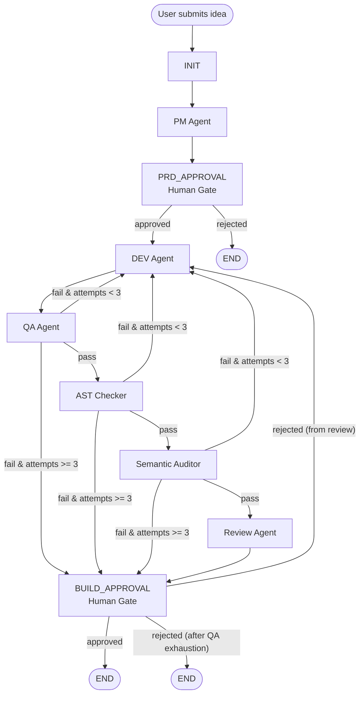

# AI Software Factory - System Requirements Document

> **Version:** 2.0.0  
> **Author:** Rahul Jidge  
> **Last Updated:** 2026-06-02  
> **Status:** Active Development

---

## 1. System Overview

The **AI Software Factory** is an autonomous software generation pipeline that takes a user's app idea and produces a compilable **Kotlin Multiplatform / Android application** with minimal human intervention. It orchestrates multiple AI agents through a LangGraph state machine and pauses at human approval gates where decisions are required.

### 1.1 High-Level Flow

```text
User Idea -> PRD + JRC Generation -> PRD Approval -> Workspace Seeding -> Code Gen (TDD/MVI) -> Static Sanity Checks -> QA Build -> AST Check -> Semantic Audit -> Code Review -> Final Build Approval -> Packaging & GC -> Android App Output
```

### 1.2 Current Architecture



---

## 2. Technology Stack

| Component | Technology | Version |
|-----------|-----------|---------|
| Language | Python | ^3.11 |
| Orchestration | LangGraph | ^1.1.3 |
| API Framework | FastAPI | ^0.110.0 |
| LLM Provider | OpenAI | ^1.0.0 |
| Primary App Target | Kotlin Multiplatform + Compose Multiplatform | Android only |
| Local Build Tool | Gradle | wrapper/template based |
| Validation | ktlint, Detekt, Robolectric, Kotest | - |
| Packaging | Fastlane (Fastfile) | local |

---

## 3. Project Structure

```text
pipelineX/
├── app/
│   ├── api.py                          # FastAPI endpoints and background graph runner
│   ├── agents/
│   │   ├── pm_agent.py                 # Generates PRD and JRC
│   │   ├── dev_agent.py                # Generates/fixes KMP source files
│   │   ├── qa_agent.py                 # Saves code and runs Gradle build
│   │   ├── reviewer_agent.py           # LLM code review
│   │   ├── auditor_agent.py            # LLM semantic requirements audit
│   │   └── human_node.py               # Interrupt/resume approval gate
│   ├── graph/
│   │   └── main_graph.py               # LangGraph state machine
│   ├── core/
│   │   ├── config.py                   # .env / .env.local loading
│   │   ├── llm.py                      # OpenAI client wrapper
│   │   └── logger.py                   # Structured log helper
│   ├── tools/
│   │   ├── file_saver.py               # Parses FILE blocks and writes workspace files
│   │   ├── workspace_customizer.py     # Seeds the KMP template workspace
│   │   ├── android_builder.py          # Local Gradle build runner
│   │   ├── docker_runner.py            # Docker-based Gradle build runner (available, not primary path)
│   │   ├── ast_checker.py              # JRC-based structural checks
│   │   ├── file_manager.py             # Alternative file writer helper
│   │   ├── code_executor.py            # Placeholder
│   │   └── git_tool.py                 # Placeholder
│   ├── resources/
│   │   ├── gradle_template/            # Gradle wrapper template
│   │   └── kmp_golden_template/        # Seeded KMP project template
│   ├── frontend/
│   │   ├── index.html                  # Browser UI for approvals and logs
│   │   ├── css/styles.css              # Frontend styling
│   │   └── js/app.js                   # Frontend logic
│   ├── memory/
│   │   └── vector_store.py             # Placeholder
│   └── workflows/
│       └── main_graph.py               # Legacy/placeholder
├── artifacts/                          # Built output archives / artifacts
├── workspace/                          # Generated Android/KMP project
├── Dockerfile.android                  # Android build container
├── pyproject.toml                      # Poetry project config
├── run_pipelinex.sh                    # Bootstrap and launch script
└── tests/                              # Test files
```

---

## 4. State Schema

The pipeline passes a shared `TypedDict` through the graph.

| Key | Type | Set By | Description |
|-----|------|--------|-------------|
| `idea` | `str` | API | User-submitted app idea |
| `prd` | `str` | PM Agent | Product Requirements Document |
| `jrc` | `str` | PM Agent | JSON Requirements Catalog extracted from the PRD |
| `code` | `str` | Dev Agent | Generated or fixed source code in `FILE:` format |
| `test_result` | `str` | QA Agent | `pass` or `fail` |
| `ast_result` | `str` | AST Checker | `pass` or `fail` |
| `auditor_result` | `str` | Semantic Auditor | `pass` or `fail` |
| `conformity_matrix` | `str` | Semantic Auditor | JSON result from semantic audit |
| `attempts` | `int` | Init / QA / AST / Auditor | Retry counter |
| `review_result` | `str` | Reviewer Agent | Code review feedback |
| `error` | `str` | Any node | Fatal error message |
| `error_logs` | `str` | QA / AST / Auditor | Logs used for retry prompts |
| `last_approval` | `bool` | Human Node | Final approval decision |
| `logs` | `list[str]` | Multiple nodes | Structured pipeline log stream |

---

## 5. API Endpoints

### 5.1 `POST /start`

Starts a new pipeline run.

| Parameter | Type | Location | Required | Description |
|-----------|------|----------|----------|-------------|
| `idea` | `string` | Query | Yes | The application idea to build |

**Response**

```json
{
  "status": "started",
  "thread_id": "uuid-string"
}
```

**Behavior**
- Creates a unique `thread_id`.
- Runs `init -> pm -> prd_approval`.
- Pauses at the PRD approval gate.

### 5.2 `PATCH /prd/{thread_id}`

Updates the generated PRD before approval.

| Parameter | Type | Location | Required |
|-----------|------|----------|----------|
| `thread_id` | `string` | Path | Yes |
| `prd` | `string` | JSON body | Yes |

### 5.3 `POST /approve/{thread_id}`

Resumes the graph after a human approval gate.

| Parameter | Type | Location | Required |
|-----------|------|----------|----------|
| `thread_id` | `string` | Path | Yes |
| `approved` | `boolean` | Query | Yes |

**Behavior**
- Resumes the graph using `Command(resume={"approved": true/false})`.
- The same endpoint is used for both PRD approval and final build approval.

### 5.4 `GET /status/{thread_id}`

Returns the current graph state, next nodes, active node, and error information.

### 5.5 `GET /download-app`

Downloads the generated `workspace/` contents as a ZIP file.

| Parameter | Type | Location | Default |
|-----------|------|----------|---------|
| `name` | `string` | Query | `web_app` |

---

## 6. Agent Specifications

### 6.1 PM Agent (`pm_agent.py`)

| Property | Value |
|----------|-------|
| Purpose | Generate a detailed PRD and JRC from the idea |
| Input | `state.idea` |
| Output | `prd`, `jrc`, `logs` |
| Model | `gpt-4o-mini` |
| Max Tokens | 3000 |
| Temperature | 0.3 |

**Responsibilities**
- Expand the app idea into a detailed PRD.
- Emit a JSON Requirements Catalog in a fenced JSON block.
- The JRC is used by structural and semantic validation steps.

### 6.2 Dev Agent (`dev_agent.py`)

| Property | Value |
|----------|-------|
| Purpose | Generate or fix KMP application source files |
| Input (new) | `state.prd` |
| Input (retry) | `state.error_logs` + `state.code` |
| Output | `code`, `logs`, `test_result` |
| Model | `gpt-4o-mini` |
| Max Tokens | 8000 |
| Target | Android-only KMP project |

**Responsibilities**
- Seed the workspace on the first pass.
- Generate `FILE:`-formatted source blocks using Clean Architecture and the MVI pattern.
- Autonomously write Unit Tests (Kotest, Mockative) and headless Compose UI Tests (Robolectric).
- Keep build scripts and manifests locked during retry cycles.
- Focus on `composeApp/src/commonMain/kotlin/App.kt` and related common source files.

### 6.3 QA Agent (`qa_agent.py`)

| Property | Value |
|----------|-------|
| Purpose | Save generated code and run a local build |
| Input | `state.code` |
| Output | `test_result`, `attempts`, `error_logs`, `logs` |

**Process**
1. Parse the LLM output with `file_saver.save_files()`.
2. Write the files into `workspace/`.
3. Run static sanity checkers (`ktlint`, `Spotless`, `Detekt`).
4. Run a local Gradle build with `android_builder.run_gradle_build()`.
5. Upon packaging success, trigger Workspace Garbage Collector to purge `.gradle/` caches.
6. Return `pass` or `fail` plus build logs (compacted to save tokens).

### 6.4 AST Checker (`ast_checker.py`)

| Property | Value |
|----------|-------|
| Purpose | Check that generated code contains the structural hints described by the JRC |
| Input | `state.code`, `state.jrc` |
| Output | `ast_result`, `error_logs`, `attempts`, `logs` |

**Behavior**
- Parses the JRC JSON.
- Ensures the code contains UI/logic indicators for each requirement.
- Fails with retry logs when indicators are missing.

### 6.5 Semantic Auditor (`auditor_agent.py`)

| Property | Value |
|----------|-------|
| Purpose | LLM-based semantic verification of the generated code against the JRC |
| Input | `state.code`, `state.jrc` |
| Output | `auditor_result`, `conformity_matrix`, `error_logs`, `attempts`, `logs` |

**Behavior**
- Asks the LLM to emit a JSON conformity matrix.
- Marks failed requirements and returns feedback to the dev retry loop.

### 6.6 Reviewer Agent (`reviewer_agent.py`)

| Property | Value |
|----------|-------|
| Purpose | Final code quality review |
| Input | `state.code` |
| Output | `review_result`, `logs` |

### 6.7 Human Approval Node (`human_node.py`)

| Property | Value |
|----------|-------|
| Purpose | Pause the graph and wait for a human decision |
| Mechanism | LangGraph `interrupt()` |
| Input | Full state |
| Output | `last_approval`, `logs` |

**Usage**
- Reused at `prd_approval`.
- Reused again at `build_approval`.

### 6.8 Maintenance & Upkeep Engine (Module 5)

| Property | Value |
|----------|-------|
| Purpose | Zero-telemetry application maintenance and bug fixing |
| Telemetry Strategy | Zero remote tracking SDKs. Native OS crash logging via Play Developer API. |
| User Support | User-initiated `crash_dump.txt` email intents via snackbars. |
| Review Mining | Scrapes live Play Store reviews to extract user-reported bugs. |

---

## 7. Routing Logic

### 7.1 After PRD Approval

```text
approved -> dev
rejected -> END
```

### 7.2 After QA

```text
error in state      -> END
fail & attempts < 3 -> dev
fail & attempts >=3 -> build_approval
pass                -> ast_node
```

### 7.3 After AST Check

```text
fail & attempts < 3 -> dev
fail & attempts >=3 -> build_approval
pass                -> auditor_node
```

### 7.4 After Semantic Audit

```text
fail & attempts < 3 -> dev
fail & attempts >=3 -> build_approval
pass                -> review_node
```

### 7.5 After Final Build Approval

```text
approved                    -> END
rejected from review path   -> dev
rejected after QA exhaustion -> END
```

---

## 8. Tools and Infrastructure

### 8.1 File Saver (`file_saver.py`)

Parses `FILE: path` blocks from the LLM and writes them into `workspace/`.

**Supported behaviors**
- Full-file writes.
- Patch-style replacements using `<<<< SEARCH` / `==== REPLACE` / `>>>> END`.
- Locked-file protection for Gradle wrappers, build scripts, and manifests.

### 8.2 Workspace Customizer (`workspace_customizer.py`)

Seeds `workspace/` from `app/resources/kmp_golden_template/` and injects metadata derived from the idea.

**Responsibilities**
- Clear the previous workspace.
- Copy the golden KMP template.
- Replace placeholders such as `{{APP_NAME}}`, `{{PACKAGE_NAME}}`, and `{{NAMESPACE}}`.
- Add optional Android feature declarations when the idea implies location or camera features.

### 8.3 Android Builder (`android_builder.py`)

Runs a local Gradle build in `workspace/`.

| Setting | Value |
|---------|-------|
| Command | `./gradlew :composeApp:assembleDebug` |
| Timeout | 600 seconds |
| Environment | Forces `JAVA_HOME` and `ANDROID_HOME` |

### 8.4 Docker Runner (`docker_runner.py`)

Provides a Docker-based build path for Android compilation.

**Current role**
- Available as a utility.
- Not the primary QA path in the current graph.

### 8.5 AST Checker (`ast_checker.py`)

Validates that the generated code includes structural indicators for each JRC item.

### 8.6 Semantic Auditor (`auditor_agent.py`)

Uses an LLM to check whether the generated code actually satisfies the JRC semantically.

---

## 9. Environment Configuration

### Required Environment Variables

| Variable | Description |
|----------|-------------|
| `OPENAI_API_KEY` | OpenAI API key used by the agents |

### Local Environment Files

- `.env`
- `.env.local`

### Build Prerequisites

- Python 3.11
- Poetry
- Java 17
- Android SDK if you want local Gradle builds

---

## 10. Running the System

```bash
# 1. Install dependencies
poetry install

# 2. Start the API server
poetry run uvicorn app.api:app --reload

# 3. Start a pipeline
curl -X POST "http://localhost:8000/start?idea=Expense%20Tracker%20App"

# 4. Review and update the PRD if needed
curl -X PATCH "http://localhost:8000/prd/{thread_id}" \
  -H "Content-Type: application/json" \
  -d '{"prd":"..."}'

# 5. Approve the PRD
curl -X POST "http://localhost:8000/approve/{thread_id}?approved=true"

# 6. Approve the final build when the graph pauses again
curl -X POST "http://localhost:8000/approve/{thread_id}?approved=true"

# 7. Download the generated app archive
curl -O "http://localhost:8000/download-app?name=expense_tracker"
```

---

## 11. Logging System

The system uses structured graph-flow logs to show pipeline progress.

Typical sequence:

```text
PIPELINE STARTED
├─ [INIT] Initializing pipeline
├─ [PM] Started - generating PRD
├─ [PM] Completed - PRD and JRC generated
├─ [APPROVAL] Waiting for human approval
├─ [DEV] Started - generating KMP code
├─ [QA] Started - validating build
├─ [AST] Started - parsing structural requirements
├─ [AUDITOR] Started - semantic audit
├─ [REVIEW] Started - reviewing code
├─ [APPROVAL] Waiting for human approval
├─ [APPROVAL] Approved
```

### Log Sources

The main prefixes currently used in logs are:

- `[INIT]`
- `[PM]`
- `[DEV]`
- `[QA]`
- `[AST]`
- `[AUDITOR]`
- `[REVIEW]`
- `[APPROVAL]`
- `[ROUTER]`
- `[API]`
- `[FILE_SAVER]`
- `[CUSTOMIZER]`

---

## 12. State Machine Checkpointing

| Feature | Implementation |
|---------|---------------|
| Checkpointer | `MemorySaver` |
| Thread Isolation | Unique `thread_id` per run |
| Interrupt/Resume | `interrupt()` + `Command(resume=...)` |
| Persistence | In-memory only |

> **Note:** State is lost on server restart. Persistent storage is a future improvement.

---

## 13. Placeholder and Legacy Modules

| Module | Status | Notes |
|--------|--------|-------|
| `app/configs/model_config.py` | Placeholder | Not wired into the graph |
| `app/memory/vector_store.py` | Placeholder | No RAG layer yet |
| `app/tools/code_executor.py` | Placeholder | Not implemented |
| `app/tools/git_tool.py` | Placeholder | Not implemented |
| `app/workflows/main_graph.py` | Legacy | Real graph lives in `app/graph/main_graph.py` |
| `app/tools/file_manager.py` | Auxiliary | Overlaps with `file_saver.py` |
| `app/tools/docker_runner.py` | Auxiliary | Available but not primary QA path |

---

## 14. Known Limitations and Future Improvements

### Current Limitations

1. In-memory checkpointing only.
2. Single hardcoded LLM model path in `app/core/llm.py`.
3. Retry counting is shared across validation stages.
4. Review feedback is not yet fully threaded back into the dev retry prompt.
5. No authentication on API endpoints.
6. Build success depends on the local Android/Java toolchain.
7. Some legacy modules and docs still exist alongside the new KMP pipeline.

### Recommended Improvements

1. Persist graph state with SQLite or Postgres.
2. Externalize model selection into config.
3. Separate retry counters per validation stage.
4. Feed `review_result` back into the dev retry prompt.
5. Add auth for API endpoints.
6. Add CI validation for the generated KMP workspace.
7. Remove or consolidate legacy placeholder modules.

