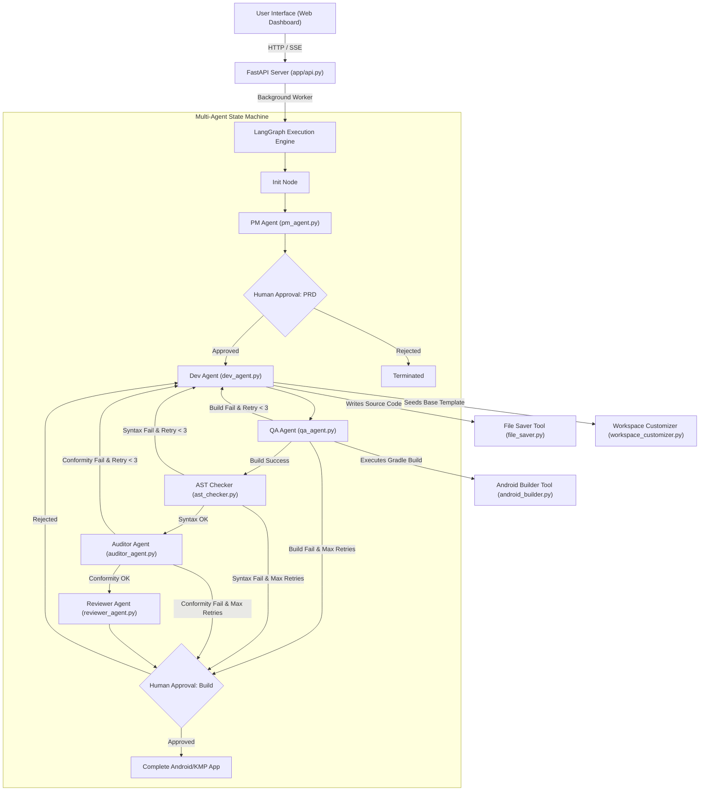

# PipelineX - Technical Documentation

> **System Version:** 2.0.0  
> **Target Architecture:** Kotlin Multiplatform (KMP) & Android Application Factory  
> **Core Frameworks:** LangGraph, FastAPI, Python 3.11+, Gradle SDK, HTML5/CSS3/JS  

---

## 1. System Overview & Architecture

**PipelineX (AI Software Factory)** is an autonomous multi-agent software engineering environment designed to transform user app concepts into compiled, verified, and reviewed **Kotlin Multiplatform (KMP) / Android applications** with human-in-the-loop governance.

### 1.1 Core Principles

- **Autonomous Multi-Agent Orchestration:** Powered by **LangGraph** state machines, specialized AI agents act as virtual software engineers (PM, Developer, QA, Auditor, Reviewer).
- **Self-Correction & Automated Validation Loops:** Automatic retry mechanisms for compilation errors, AST syntax failures, and PRD requirement non-conformity (up to 3 retries).
- **Human-in-the-Loop Approval Gates:** Asynchronous approval checkpoints where human users review generated PRDs and final build candidates.
- **Dynamic Workspace Seeding:** Template-based workspace initialization, package refactoring, and directory structure generation.
- **Pre-Compilation Quality Gates:** Enforces Test-Driven Development (TDD) and static code checks (`ktlint`, `Detekt`) *before* expensive compilation cycles.
- **Zero-Telemetry Native Upkeep:** Privacy-first design operating without 3rd-party tracking SDKs; relies on native OS vitals and user-initiated feedback loops.

### 1.2 Component Architecture Diagram



---

## 2. Multi-Agent State Machine & Routing

The backbone of PipelineX is defined in `app/graph/main_graph.py` using `StateGraph`.

### 2.1 Pipeline State Schema

The shared dictionary `State` tracks all context across agent nodes:

| Field Name | Type | Description |
| :--- | :--- | :--- |
| `idea` | `str` | Initial high-level application prompt provided by the user. |
| `prd` | `str` | Product Requirements Document generated by the PM Agent. |
| `jrc` | `str` | JSON Requirement Specification detailing screens, data models, and features. |
| `code` | `str` | Generated Kotlin/Android source code output. |
| `test_result` | `str` | Gradle build outcome (`pass` or `fail`). |
| `ast_result` | `str` | AST syntax check outcome (`pass` or `fail`). |
| `auditor_result` | `str` | Semantic requirement audit outcome (`pass` or `fail`). |
| `conformity_matrix` | `str` | Markdown table generated by Auditor comparing implementation against JRC. |
| `attempts` | `int` | Counter tracking dev-repair retry cycles (max 3). |
| `review_result` | `str` | Final code review summary and score from Reviewer Agent. |
| `error` | `str` | Unhandled error message if pipeline halts. |
| `error_logs` | `str` | Detailed Gradle compiler log or AST syntax error output. |
| `last_approval` | `bool` | Decision flag submitted at human approval gates. |
| `approval_context` | `str` | Identifies which approval checkpoint is active (`prd` or `review`). |
| `logs` | `list[str]` | Real-time structured pipeline step logs streamed to the frontend UI. |

---

## 3. Agent Specifications & Responsibilities

### 3.1 PM Agent (`app/agents/pm_agent.py`)
- **Role:** Product Manager.
- **Functions:** Translates raw user ideas into formal Product Requirements Documents (PRDs) and JSON Requirement Contracts (JRC).
- **Outputs:** Populates `state["prd"]` and `state["jrc"]`.

### 3.2 Dev Agent (`app/agents/dev_agent.py`)
- **Role:** Lead Mobile Developer (Kotlin Multiplatform & Android).
- **Functions:** 
  - Seeds workspace using `WorkspaceCustomizer`.
  - Parses PRD/JRC and writes Clean Architecture-compliant code using the MVI pattern for UI state.
  - Implements Test-Driven Development (TDD) via Unit and Compose UI Tests.
  - Handles bug fixes by analyzing compiler/error logs (`state["error_logs"]`).
- **Tools:** Uses `file_saver.py` to write/update `.kt`, `.xml`, `build.gradle.kts` files.

### 3.3 QA Agent (`app/agents/qa_agent.py`)
- **Role:** Quality Assurance & Build Engineer.
- **Functions:** 
  - Triggers static sanity checkers (`ktlint`, `Spotless`, `Detekt`).
  - Triggers Gradle compilation (`./gradlew assembleDebug` or `test`) via `android_builder.py`.
  - Triggers Workspace Garbage Collector after successful builds.
- **Outputs:** Updates `state["test_result"]` to `pass` or `fail` and extracts compiler output into `state["error_logs"]`.

### 3.4 AST Checker Node (`app/tools/ast_checker.py`)
- **Role:** Static Code Analysis.
- **Functions:** Analyzes generated Kotlin files for syntax errors, unclosed brackets/braces, invalid imports, and structural flaws before executing lengthy builds.
- **Outputs:** Sets `state["ast_result"]` (`pass`/`fail`).

### 3.5 Auditor Agent (`app/agents/auditor_agent.py`)
- **Role:** Compliance & Semantic Auditor.
- **Functions:** Compares the generated codebase directly against the JSON Requirement Contract (JRC) to ensure all requested screens, features, and UI elements exist.
- **Outputs:** Sets `state["auditor_result"]` (`pass`/`fail`) and populates `state["conformity_matrix"]`.

### 3.6 Reviewer Agent (`app/agents/reviewer_agent.py`)
- **Role:** Principal Code Reviewer.
- **Functions:** Inspects code quality, architecture adherence, security best practices, and memory management.
- **Outputs:** Fills `state["review_result"]`.

### 3.7 Human Approval Node (`app/agents/human_node.py`)
- **Role:** Governance Gate.
- **Functions:** Pauses graph execution using LangGraph `interrupt()` mechanism, awaiting explicit user input via the web dashboard.

---

## 4. Subsystems & Tools

### 4.1 Workspace Customizer (`app/tools/workspace_customizer.py`)
Clones base project templates into `workspace/`, renames application packages, updates `namespace` in `build.gradle.kts`, and configures `AndroidManifest.xml`.

### 4.2 File Saver (`app/tools/file_saver.py`)
Parses Markdown code blocks from Dev Agent responses, safely writes files to the target workspace directory, generates directory tree structures, and prevents path traversal vulnerabilities.

### 4.3 Android Builder (`app/tools/android_builder.py`)
Executes `./gradlew` commands inside the targeted Android application folder, captures stdout/stderr, and parses stack traces for error resolution.

### 4.4 Comprehensive CI/CD Packager
Generates `Fastfile` configurations to automate `.jks` signing, metadata generation, and Git tagging for zero-touch deployment prep.

### 4.5 Workspace Garbage Collector
Actively manages local storage constraints by purging massive `.gradle/` caches immediately following a successful app packaging step.

---

## 5. REST & Streaming API (`app/api.py`)

Built with **FastAPI**, providing async background execution, SSE log streaming, and human gate interaction.

### 5.1 Key Endpoints

| Method | Endpoint | Description |
| :--- | :--- | :--- |
| `POST` | `/start?idea={idea}` | Starts a new pipeline thread in background. Returns `thread_id`. |
| `GET` | `/status/{thread_id}` | Retrieves full state snapshot, active node, and approval status. |
| `POST` | `/approve/{thread_id}` | Submits human approval decision (`approved: true/false`). |
| `PUT` | `/prd/{thread_id}` | Updates PRD content directly from UI prior to approval. |
| `GET` | `/stream/{thread_id}` | Server-Sent Events (SSE) stream for real-time log output. |
| `GET` | `/tree/{thread_id}` | Returns hierarchical directory tree of generated workspace. |
| `GET` | `/file/{thread_id}?path=...` | Reads content of specific file in the workspace. |

---

## 6. Frontend UI Architecture (`app/frontend/`)

- **HTML5 & Vanilla CSS (`index.html`, `styles.css`):** Glassmorphic dark UI dashboard with responsive sidebars, terminal logging view, and PRD/Code split editor.
- **Client Logic (`app.js`):**
  - Manages SSE connection to `/stream/{thread_id}`.
  - Dynamically updates active node status in the pipeline header visualization.
  - Displays human-in-the-loop approval modals with PRD inline editing.

---

## 7. Execution & Operational Commands

### 7.1 Running the Server
```bash
# Launch FastAPI app with auto-reload
poetry run uvicorn app.api:app --host 0.0.0.0 --port 8000 --reload
```

### 7.2 Running Helper Script
```bash
# Start server with convenient wrapper script
./run_pipelinex.sh
```

### 7.3 Operational Targets (Makefile)
```bash
make run      # Starts FastAPI server
make test     # Executes test_pipeline.py
make clean    # Removes cached files and temporary build artifacts
```
