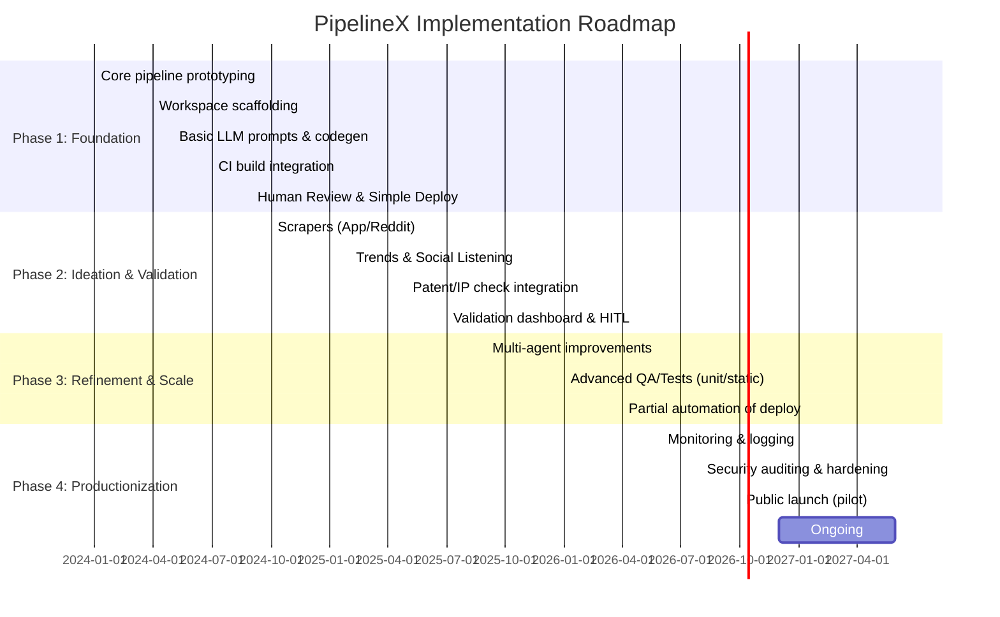

# Executive Summary  
PipelineX envisions a **zero-budget, always-on AI Venture Studio** that autonomously discovers app ideas and fully automates the Android SDLC with human-in-the-loop (HITL) checks. It combines multi-agent orchestration (LangGraph in Python) with Kotlin Multiplatform (KMM/Compose) app generation. Key capabilities include continuous ideation (scraping app reviews, trends, forums), rigorous idea validation (market data, technical feasibility, IP/patent scans), and an AI-driven development pipeline (Product Manager, Planner, Dev, QA, Reviewer agents) culminating in automated build, code review, and Play Store deployment (via Fastlane) upon approval. This report analyses feasibility and requirements, and outlines an MVP, risks, roadmap, and maintenance plan for long-term support. Official sources (e.g. Gradle, Kotlin, Google Play, Fastlane docs) are cited throughout.

## 1. MVP Feature List & HITL Checkpoints  

**Minimal Viable Pipeline (MVP):**  
- **Ideation & PRD:** Generate basic app concepts from existing prompts or minimal crawlers. Produce a concise Product Requirements Document (PRD) summarising app features.  
- **Dev Pipeline:** Generate a simple, skeleton Kotlin Multiplatform Android app from the PRD (basic screens, models, Gradle setup). Ensure all Gradle scripts and AndroidManifest are valid.  
- **Build & QA:** Execute `gradlew build` inside a Docker container to compile the project. Run any simple unit or lint tests.  
- **Reviewer:** AI agent performs a high-level code quality check (style, architecture).  
- **Deploy:** Package an Android App Bundle (AAB) and upload to Google Play internal track via Fastlane (using a Google Service Account).  

**Strict HITL Checkpoints:**  
1. **Idea Approval:** Human reviews and refines the generated idea/PRD before coding. Ensures no hallucinated or unethical concept proceeds.  
2. **Architecture Approval:** After Dev agent generates code, human inspects critical parts (especially architecture, dependencies). Ensures the design meets requirements.  
3. **Pre-Deploy Approval:** Before publishing, human enters the keystore credentials and approves the release for Play Store.  

**HITL Roles & Actions:** At each checkpoint, the system halts (LangGraph `Interrupt`) and awaits a manual “approve/reject/modify” input. This prevents fully autonomous releases and allows expert oversight.  

## 2. Feasibility Analysis  

**Technical Feasibility:**  
- **Multi-Agent Orchestration:** LangGraph (LangChain’s graph-based workflow) supports directed multi-agent flows. Each agent is a node, edges manage control flow and shared state. This suits our PM→Planner→Dev→QA→Reviewer pipeline. Prior research (HyperAgent, MASAI) shows multi-agent coding assistants can greatly improve success on complex tasks by dividing work among specialized agents.  
- **LLM Output Limits:** Generating full apps in one shot hits token limits. Strategies like multi-step generation (generate Gradle files first, then code) and concise prompts are needed. Official docs advise splitting complex tasks (context windows are limited). We must design prompts to produce files incrementally and validate at each step to avoid truncation.  
- **Compose Multiplatform:** KMM + Compose multiplatform is fully supported via Gradle. The shared `commonMain` code compiles across Android/iOS. Official Kotlin docs show using `plugins { kotlin("multiplatform") ... }` and Compose Multiplatform framework for UI. Compatibility tables (e.g. Kotlin plugin vs Gradle versions) must be considered to avoid build errors.  

**Legal/IP Feasibility:**  
- **Patent & Trademark Checks:** “Google Patents API” is deprecated; instead use USPTO’s Open Data Portal or PatentsView for patent search. We can query USPTO ODP for relevant patent keywords (free REST API) or Lens.org API (broad coverage). For trademarks/package names, a Google Play package-availability check suffices (using Google Play Developer API to see if an ID is taken). These checks add minimal cost (many are free or require simple scraping).  
- **Data Licensing:** Scraping app reviews (Google Play, Reddit) is legal if only public data is accessed. Use official APIs where possible (e.g. Reddit API, Trends API). The new **Google Trends API (alpha)** (2025) provides official search-volume data. We'll rely on public domain data (reviews, social media) for ideation, so IP risk is low if we report findings without revealing private data.  

**Operational Feasibility (Zero Budget):**  
- **Compute:** The pipeline can run on modest servers. Running LLM calls (via cloud API) plus a Docker-based Android build is compute-intensive. Without budget, use free compute tiers (see hosting below). Multi-agent management (LangGraph) runs in Python on the same host. We must minimize overhead: e.g. use OpenAI’s free/included quota if available, otherwise limit API calls.  
- **Reliability:** Continuous operation requires handling errors (LLM timeouts, API changes). LangGraph’s stateful design allows pausing on errors and resuming. Build failures loop back to Dev agent with error logs. If unresolved after N retries, escalate to human (HITL). This minimizes perpetual loops.  
- **Community/Team:** With no dedicated team, the system should be mostly autonomous. Maintenance (monitoring logs, updating prompts, tweaking pipelines) can be done ad-hoc by a single developer. The system’s design should favour resilience and configurability (using config files and clearly logged events).  

**Risks & Mitigations (Prioritized):**  
- **LLM Truncation & Hallucination:** Very real. Mitigation: break prompts into smaller tasks, validate outputs, enforce strict file formats (e.g. `FILE:` markers) so parsing is robust. Use tests to catch missing code (see section 6).  
- **Deployment Security:** Managing signing keys and Play Console access requires care. Use environment variables and encrypted secrets, not embedding keys in code (see sec. 9).  
- **API Rate Limits/Changes:** Free APIs (Reddit, Trends) may rate-limit or change terms. Mitigation: cache results, use paid alternatives only if needed, build scrapers robustly.  
- **Legal Compliance:** App ideas might infringe patents or trademarks. Mitigation: rely on explicit checks (ODP API, Play store search). Block any idea that clearly conflicts (use LLM to interpret patent results). Always have legal review on borderline cases.  
- **Operational Load:** Zero budget means using free tiers (which sleep/limited). Monitor usage and switch to manual when limits hit. Possibly negotiate small credits (some services give $100/mo free).  

## 3. Detailed Requirements  

### Software Components  
- **LangGraph Orchestrator:** Python (LangGraph/Antigravity) to manage agent flows and state. Agents communicate by shared `state`.  
- **AI Agents (Python):**  
  - *PM/Planner Agents:* LLM-based (e.g. GPT-4o or Anthropic Claude) for PRD writing and task planning.  
  - *Dev Agent:* LLM for code generation. Use carefully engineered prompts (see section 6) to produce complete files in the multi-file format.  
  - *QA Agent:* Runs Gradle builds (via a Dockerized Android SDK environment).  
  - *Reviewer Agent:* LLM-driven code review (using tools like CodeBERT or GPT-4).  
- **Language & Tools:** Kotlin Multiplatform (latest stable, e.g. Kotlin 2.x) with Compose Multiplatform UI. Gradle (Kotlin DSL) as build system. Compose Multiplatform libraries (Jetpack Compose, etc). Backend (if any) in Ktor or Python(FastAPI) for simple APIs.  
- **Prompt Templates:** Stored centrally, versioned in repo. Strict formats (Markdown code fences) to parse LLM outputs reliably.  

### Infrastructure  
- **CI Build Agents:** Docker image with OpenJDK 11+, Android SDK & NDK, Kotlin/Gradle. Use a ready image (e.g. Google’s android emulator images, or assemble a custom Dockerfile).  
- **Data Crawling/Analytics:** Lightweight Python scripts running scheduled (cron) or continuously:  
  - *Google Play Scraper* (e.g. JoMingyu’s [5†]).  
  - *Reddit API* via PRAW or direct HTTP (subreddits like r/Entrepreneur).  
  - *Google Trends API* (official, requires API key). Alternatively, PyTrends library.  
  - *Twitter/X API* (v2) for trending topics (if budget allows; or use Twitter’s free tier 500K tweets/month).  
  - *News/Trends APIs:* (e.g. NewsAPI.org, though API key needed; Wikipedia API; Google News RSS).  
- **Service Accounts:**  
  - *Google Cloud Service Account* for Play Store access. As per Fastlane, use a JSON key. Keep it out of code, store securely (see sec.9).  
  - *Patent Search:* Use USPTO ODP (no account needed) or register for Lens.org API key (free academic tier).  
  - *Scraping Auth:* Not needed (public data).  
- **Datastore (Optional):** To persist ideas, PRDs, code versions, logs. Could be simple JSON files or SQLite. Even Google Sheets API if needed.  
- **Build & Release Automation:**  
  - *Fastlane (supply)* for Play Store publishing.  
  - *Gradle wrapper (`gradlew`)* included in seeded workspace to ensure consistent builds. Gradle wrapper is standard practice.  
  - *Fastlane Plugin*: use `supply` for upload, `playstore_path` for APK/AAB.  
- **Logging & Monitoring:**  
  - Log pipeline events (LangGraph logs) and agent actions to a file or console (LangGraph has logging hooks).  
  - Build logs captured by QA agent (stdout/stderr).  
  - Use a logging platform if possible (Logtail, Papertrail, or free-tier ELK). Set alerts on repeated failures.  
  - Keep an **audit trail** of decisions: PRDs, prompts, error logs, approvals. This may be as simple as appending to a Google Sheet or writing to an audit log file in repo.  

### Data Sources / APIs  
- **App Reviews:** Google Play (via scraping libraries) and optionally Apple App Store (via RSS or iTunes API). Focus on negative reviews to spot unmet needs.  
- **Social / Forum Data:** Reddit (PRAW or API) on r/Entrepreneur, r/FindAnApp, r/startups; Quora (limited API, likely skip); Twitter/X trending (API v2).  
- **Trends:** Google Trends API (beta) for search interest. NewsAPI or RSS feeds for emerging topics.  
- **Competitive Data:** App store rankings (via scraping). Use `google-play-scraper` (Node/Python) to get top apps by category and their stats.  
- **Patent/IP:** USPTO Open Data Portal (free REST); Lens.org (free academic); PatentsView. Google Play Developer API to check package name.  
- **Market Data:** Public stats (e.g. Census, World Bank), likely not needed for MVP.  

### Security & Secrets  
- **Android Keystore:** The upload key (.jks) must never go into the repo. It should be provided manually at deploy time or stored encrypted. Fastlane’s match (for iOS) suggests encrypting in a secure vault. For Android, best to **manually upload keystore** via a secure UI or use Google Play App Signing.  
- **Environment Variables / Secrets:** Use the CI/CD platform’s encrypted secrets feature. CircleCI recommends storing secrets in encrypted env vars/contexts. Similarly, GitHub Actions or others. Keep JSON service keys, API tokens, etc. encrypted. Decrypt only at runtime during build.  
- **Network Security:** All API calls over HTTPS. Isolate Docker builds. No direct exposure of pipeline internals to public.  
- **Consent & Compliance:** Ensure not to violate terms of scraped sources (e.g. Twitter’s ToS). For Play Store, abide by Google’s policies (no duplication of policy-violating features).  

### Monitoring & Logging  
- **Error Alerts:** Monitor build failures: if >3 consecutive fails, email or notify on a channel (could use a free Slack/Discord webhook).  
- **Pipeline Metrics:** Track daily build counts, success/fail rate, agent response times (LLM latency), idea generation volume.  
- **Logging:** Centralized logging (e.g. Grafana Loki free tier, or just files). Include context IDs so logs can be traced through pipeline steps.  
- **User Access:** Since no team specified, likely a single admin plus optional collaborators. Use GitHub org with member roles.  

## 4. Implementation Roadmap  

Below is a phased timeline (Gantt chart) covering design, MVP, expansion, and stabilization. Each phase ends with a review (HITL gating to proceed).



**Milestones:**  
- *MVP Launch (end of Phase 1):* The system can take a manually entered idea, generate a basic app, build it, and package an APK.  
- *Market-Ready Pipeline (end of Phase 3):* Automated idea acquisition, validation, robust multi-step code generation, and automatic deployment to Play’s beta track with minimal human approval.  

**Dependencies & Overlap:**  
- Idea validation tools (Phase 2) can start while Phase 1 stabilizes.  
- QA/Testing enhancements should be introduced before scaling up app complexity to catch issues early.

## 5. Maintenance & Governance  

- **HITL Policy:** Define clear criteria for human review. For example, require human sign-off if QA fails ≥3 times, or if the app concept touches regulated domains (fintech, health). Log each approval decision with rationale (e.g. “Approved: PRD looks technically feasible”).  
- **Retry Limits:** Cap Dev agent attempts at 3. If still failing, trigger human dev intervention. Similarly, if deployment fails after 3 automated tries (e.g. signing error), alert the team.  
- **Audit Trails:** Every action (idea accepted, code generated, error fixed) is logged with timestamp. Use LangGraph’s state logging and append to a commit or external log store. This ensures we can “undo” or analyze pipeline history.  
- **Rollback Strategy:** If a deployed app misbehaves or violates policy, maintain backups of previous version. Use Google Play’s rollout management (Fastlane can promote or roll back if needed). The pipeline should support redeploying an earlier AAB by passing a special command.  
- **Incremental Updates:** Version the pipeline code and prompts. For AI prompts, keep them in a repo so changes are tracked. Periodically update prompts to incorporate new best practices (e.g. new Compose APIs, or LLM improvements).  
- **Governance Meetings:** Even on a small team, schedule quarterly reviews of metrics (ideas approved, builds passed) and next steps. Use these to adjust strategy and allot limited resources (e.g. decide if some non-essential modules can be dropped to save compute).

## 6. Agent Prompts & Output Patterns  

**Prompts to Reduce Truncation & Corruption:**  
- **Modular Generation:** Instruct the Dev agent to produce **one file at a time** or specific sections. E.g. first prompt: “Generate **only** `settings.gradle.kts`, `build.gradle.kts`, and `AndroidManifest.xml`” with strict format. Then proceed to code files. This prevents hitting token limits.  
- **Explicit BOUNDARIES:** Use directives like “Do NOT include any extra text beyond the file contents.” For example, format every file as:  
  ```
  FILE: path/to/File.kt
  ```kotlin
  (code here)
  ```
  Do not include any analysis or extraneous text between file blocks.  
- **Validation Checks:** After generation, have the agent auto-check for key tokens. For instance, require “plugins { … kotlin(‘multiplatform’)” in Gradle files; if missing, abort. This can be in the prompt (“Gradle files must contain a plugins block”).  
- **Error-Focused Prompts:** When QA returns an error log, feed **only the relevant excerpt** (grep “error” lines or “Unresolved reference”) to Dev, plus the affected file’s content. This avoids overwhelming the LLM with irrelevant context.  
- **System Messages / Style:** Use system prompts (LangGraph supports them) to enforce style: e.g. “You are a meticulous senior Kotlin dev. Focus on correctness and imports.” Include bullet lists of common mistakes (as in current Dev agent rules).  

**Sample Improved Prompt Snippet:**  
```
You are a Kotlin expert. The build failed. Fix only the imports and code in `App.kt`. 
Original code snippet:
```kotlin
package my.app
// rest of code here
```
Errors: Unresolved reference: Modifier, StarBorder.
Make sure to add `import androidx.compose.ui.Modifier` and material icon imports.
Return the full **fixed** App.kt file with all imports and code.
```
  
Use *assertive language* (“MUST”, “STRICTLY”) to minimize model hallucinations.  

## 7. Validation Tests & CI Checks  

**Unit & Integration Tests:**  
- Write basic JUnit tests for critical logic (e.g. business rules). Store them under `commonTest`. Even trivial tests (like checking a data model’s default values) help validate project structure. Use KMM’s built-in test runner.  
- Use **Kotlinx.coroutines Test** for coroutine-based code.  

**Static Analysis:**  
- **ktlint:** Include in Gradle to enforce coding style. E.g. a Gradle task `ktlintCheck`.  
- **Detekt:** For static code analysis (finds code smells or unused code). Add to CI (via Gradle plugin).  
- **Android Lint:** Run `gradlew lint` on the Android module. It catches resource or performance issues.  

**CI Build Checks:**  
- Create a CI workflow (GitHub Actions or similar) that on each commit:  
  1. **Pull Code:** From repository (public repo to use free CI minutes).  
  2. **Dependency Audit:** (Optional) Run `gradlew dependencies` or use OWASP dependency-check plugin.  
  3. **Compile:** `./gradlew clean build`. Fail on any error.  
  4. **Unit Tests:** `./gradlew test`.  
  5. **Lint Checks:** `./gradlew lint ktlintCheck detekt`.  
  6. **Package:** If all pass, assemble an AAB (via `bundleRelease`).  
  7. **Spellcheck/Docs:** (Optional) check PRD text for typos.  

- **GitHub Actions Sample (excerpt):**  
  ```yaml
  name: CI Pipeline
  on: [push]
  jobs:
    build:
      runs-on: ubuntu-latest
      steps:
        - uses: actions/checkout@v3
        - name: Set up JDK 11
          uses: actions/setup-java@v3
          with:
            distribution: 'temurin'
            java-version: '11'
        - name: Run Gradle build
          run: ./gradlew clean build ktlintCheck detekt
        - name: Archive AAB
          if: success()
          uses: actions/upload-artifact@v3
          with:
            name: app-aab
            path: app/build/outputs/bundle/release/app-release.aab
  ```  

**Import/Dependency Checks:**  
- Add a Gradle task or script to scan for “unresolved references” (static, if possible) or to list all Kotlin imports. Fail if common misspelled imports appear (e.g. `android.ui.Modifier` vs `androidx.compose.ui.Modifier`).  

**Lint for CI Agents:** Ensure QA agent fails fast on missing imports (catch “Unresolved reference”) and triggers a Dev agent retry.  

## 8. Zero-Cost Hosting Options  

| **Option**           | **Free Tier/Resources**                    | **Key Pros**                            | **Limitations/Trade-offs**               |
|----------------------|--------------------------------------------|-----------------------------------------|------------------------------------------|
| **GitHub Actions**   | Free for public repos (2000 min/mo); 500MB storage; includes self-hosted runners | Integrated with code, good for CI/CD. New **Jan’26**: hosted runners ~39% cheaper. Remains free for OSS. | Private repos limited free minutes; self-hosted runners incur $0.002/min from Mar’26. Not for hosting servers (CI only). |
| **Render (free)**    | 1 web service, 2 static sites (sleep after 15m idle). | Simple setup, automatic deploys from GitHub. Supports cron jobs (for crawlers). Includes managed PostgreSQL (hobby). Clear upgrade path. | Sleeps on idle (cold starts ~30s). Limited to single region. No direct free SSL wildcard (but auto-HTTPS for domains). |
| **Fly.io (free)**    | 3 shared-cpu-1x VMs, 160GB-hr (2000 CPU-hr) per month.                    | Global edge deployment, fast scaling. Generous compute time. Free $5/mo credit. | Requires Docker/Dockerfile. More complex than Heroku-style. Community reports occasional instability. Limited free Postgres (3 shared CPUs). |
| **Railway (free)**   | $5 credit/mo (usually enough for light usage). | Git-based deploys, supports Postgres/Redis out-of-box. Fast setup (zero config). Preview environments. | Credit-depletion stops services. No free multi-region. UI-centric (no repo YAML option unless paid). |
| **Fly.io vs Render** | Flight.io: Regional (LATAM in India?), 
Render: Multi-regional (requires paid). |
| **Self-host (free tiers)**| AWS/GCP/Azure free tier VMs; Oracle “Always Free” VMs. | Full control, stable. No PaaS lock-in. No sleeping. Free credits for new accounts (e.g. AWS $100, GCP $300). | Setup & maintenance heavy. Need to manage OS/updates. Database not included (unless use free tier DB). |

_Render and Fly.io comparison:_ A 2026 survey notes **Render** has the “most generous free tier for getting started,” whereas **Fly.io** offers better performance/pricing but demands more setup. Render’s free services sleep after inactivity (30+ second cold start), acceptable for dev but not ideal for user-facing APIs.

**Other CI/CD:** For pure CI, GitHub Actions (public) or GitLab CI (free 400 min) can be used. But they don’t host running servers or cron jobs. For hosted runners, GitHub now charges $0.002/min on March 2026.

## 9. Security Checklist for Automated Deploys  

- **Android Keystore Handling:** Do **not** store keystore in the repo. Use Google Play App Signing to upload only APK/AAB and let Google re-sign (preferred). If self-signing, encrypt the `.jks` file (e.g. with OpenSSL) and keep decryption passphrase in CI secret. Decrypt at deploy time only.  
- **Service Account Keys:** The Google Play JSON key is sensitive. Store it as an encrypted secret or use **Workload Identity Federation** (see Fastlane’s guidance). Ensure minimal IAM scope (e.g. only “Release management – Release” permissions). Periodically rotate credentials.  
- **CI/CD Secrets:** All API tokens (LLM API key, database tokens, etc.) must be in encrypted env vars/contexts. Do **not** echo them in logs. Mask secrets in CI outputs.  
- **Least Privilege:** Fastlane docs recommend using a service account with only needed permissions (avoiding overly broad roles). For example, give Play Console access but skip “Publishing” permission if manual approval is needed.  
- **Audit & Approval:** Before the pipeline calls Fastlane to upload, require human confirmation. This prevents accidental releases. Use Git tags or PR merges as gates.  
- **Publishing Safeguards:** Integrate Play’s internal test track for first deployments. Only upon final approval (and possibly after monitoring metrics) push to production track.  
- **Alerting on Sensitive Events:** E.g., monitor for “keystore extracted” or “API key usage anomaly”. Ideally, notify developer via email/Slack if a secret is misused.

## 10. Monitoring, Metrics & Agent Flow  

**Key Metrics & Alerts:**  
- **Agent Performance:** LLM call latency, failure rate (e.g. API timeouts).  
- **Build Success Rate:** Track percentage of pipelines succeeding on first try vs needing fixes. Alert if >70% fail builds (means Dev prompts likely need improvement).  
- **Idea Pipeline:** Ideas generated per day, PRDs approved vs rejected. If too many rejections, ideation algorithms may be off.  
- **Deployment Stats:** Releases per week, rollbacks triggered.  
- **Usage Quotas:** Rate-limit usage on APIs (Reddit, Trends, LLM). Alert if near limits.  
- **Cost Metrics:** Though zero-budget, monitor credit usage (Render free hours, Fly credit) and GH Actions minutes for private runs.  
- **Security Alerts:** Any unauthorized config change, or secrets use outside expected time, should trigger an alert.

**Monitoring Dashboard Layout:** Use a time-series dashboard (Grafana, Datadog free) with:  
- Build pipeline status (pass/fail over time),  
- Agent loop count (e.g. Dev→QA loops),  
- API call counts (Trends, Reddit hits),  
- CI usage (minutes used),  
- System logs (error log spikes).  

**Flowchart of Agent Interactions:** The pipeline’s agent flow can be summarized as:

```mermaid
flowchart LR
    Idea[I: Internet Crawlers] --> PM[ProductManager Agent]
    PM --> Planner[Planner Agent]
    Planner --> Dev[Dev Agent (codegen)]
    Dev --> QA[QA Agent (build/test)]
    QA --> Reviewer[Reviewer Agent]
    Reviewer -->|OK| Deploy[Deployment Action]
    QA -- Fail --> Dev
    Reviewer -- Issues --> QA
    Deploy --> Done((Launched))
```

- **Loop:** On QA fail, feedback (error logs) flows back to Dev. On Reviewer concerns (style/security), code is rechecked or sent to human review.  
- **Timeline (example):** *(Mermaid Gantt from section 4)* shows phases from prototyping (Q1–2024) through MVP (mid-2024) to full pipeline (2026).  

By implementing robust logging, clear HITL stops, and strict prompt controls, PipelineX can iteratively build out this “AI Studio” within the zero-budget constraint. Ongoing evaluation and prompt refinement, guided by the metrics above, will be essential for long-term success.  

**Sources:** Official docs and analyses have been referenced to substantiate design choices and guidelines.